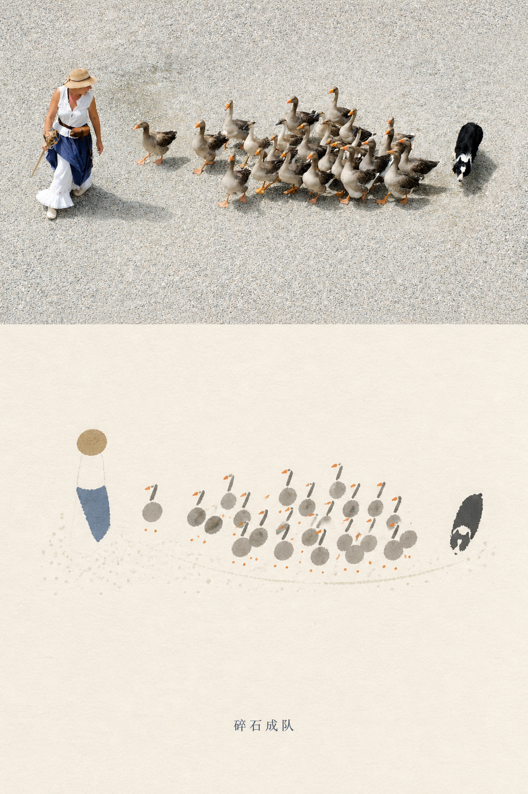
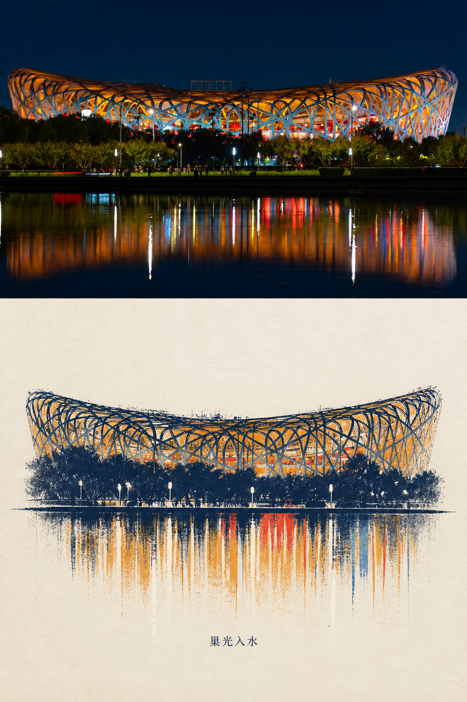
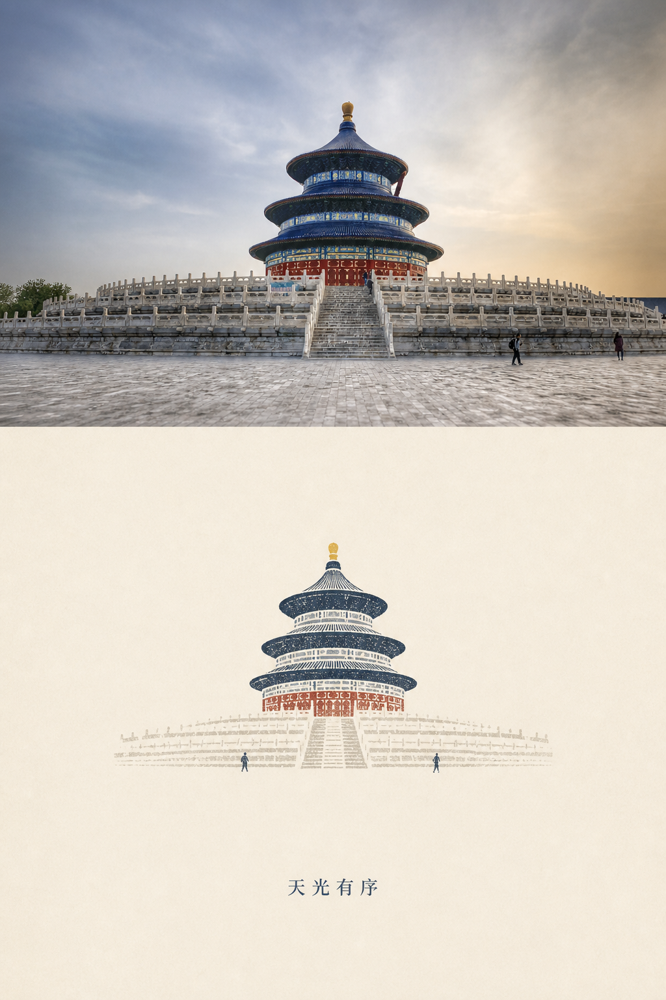
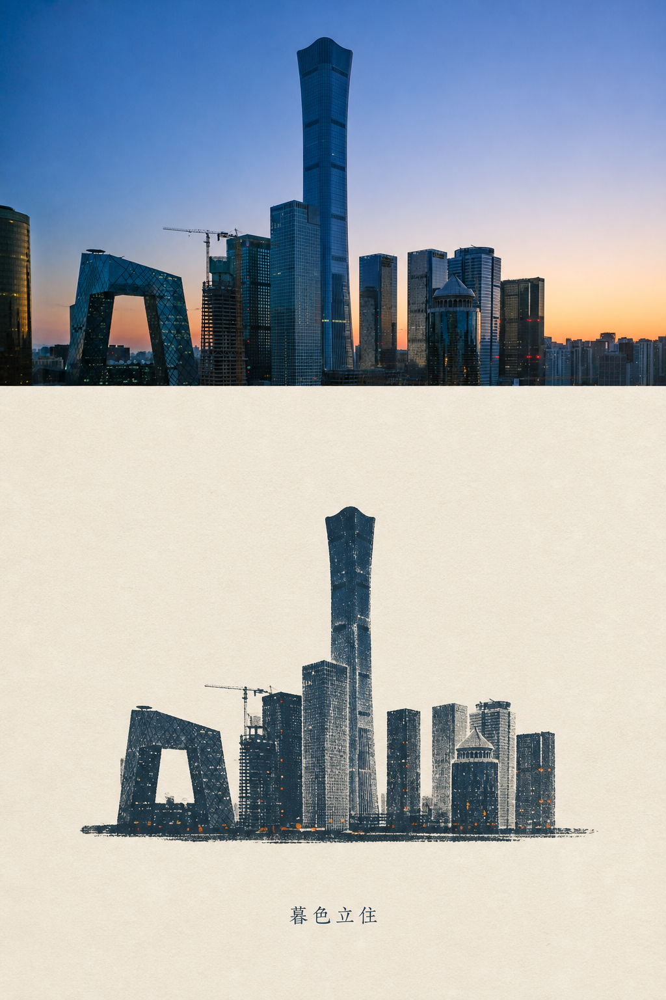
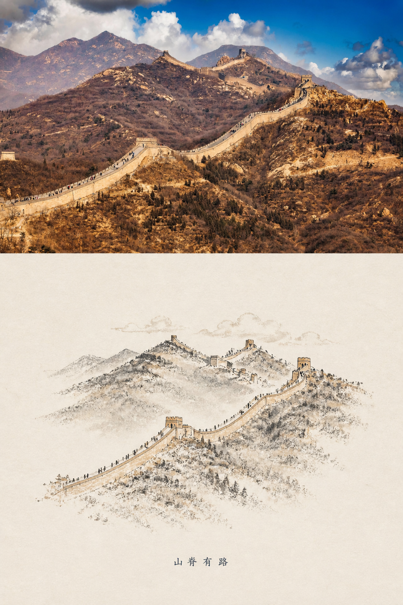
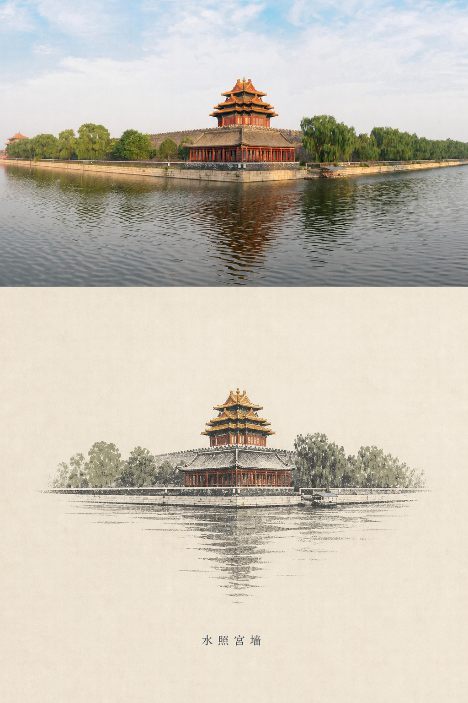

# Photo Relic Editorial / 纸上留影
把真实照片压缩成一张安静的纸上记忆版画。  
Turn real photographs into quiet paper-memory editorial artworks.

## Paper Beijing / 纸上北京

<table>
  <tr>
    <td align="center" width="33%">
      <br>
      <sub>碎石成队 / Gravel Falls Into Line</sub>
    </td>
    <td align="center" width="33%">
      <br>
      <sub>巢光入水 / Nest Light Enters Water</sub>
    </td>
    <td align="center" width="33%">
      <br>
      <sub>天光有序 / Ordered Sky Light</sub>
    </td>
  </tr>
  <tr>
    <td align="center" width="33%">
      <br>
      <sub>暮色立住 / Dusk Stands Still</sub>
    </td>
    <td align="center" width="33%">
      <br>
      <sub>山脊有路 / A Road Along the Ridge</sub>
    </td>
    <td align="center" width="33%">
      <br>
      <sub>水照宫墙 / Palace Wall in Water</sub>
    </td>
  </tr>
</table>

## 中文

Photo Relic Editorial 是一个 AI agent skill，用来把用户提供的照片转化成竖版编辑艺术图：整张图完全由 AI 重新绘制，以"纸上留影"的风格呈现——现代版画语言、东方留白、温暖的纸张质感。

它不是把照片简单画成插画，也不是极简到失去主体。它会从原图里提取结构、光线、颜色、重心和情绪，再把这些信息压缩成类似现代版画、东方留白、旅行记忆标本的视觉语言。

图片生成通过**图像生成 CLI** 完成，使用高质量图生图模型（如 Seedream 5.0），以用户照片作为参考图。整张图从头到尾由 AI 绘制，不保留任何原始照片区域。

适合的照片类型：

- 古建筑、城市地标、天际线、桥、塔、体育馆
- 有清楚轮廓、强光影、倒影或秩序感的场景
- 旅行、人群、动物队列、街头瞬间
- 可以被压缩成"形状 + 光 + 少量颜色"的摄影作品

### 安装

把整个 `photo-relic-editorial` 文件夹复制到你的 AI agent skills 目录：

```bash
cp -R ./photo-relic-editorial <your-skills-directory>/
```

### 依赖

需要一个支持**图生图 (image-to-image)** 的图像生成 API 或 CLI 工具，必须支持以下能力：

- 传入参考图片（reference image / input image）
- 设置 `strength` 参数（控制对参考图的重绘程度，建议 0.55–0.75）
- 自定义输出尺寸（宽度/高度）
- 文本 prompt 指导生成

推荐的模型：Seedream 5.0 或其他高质量图生图模型。

你可以将 skill 中的 `your-image-cli` 命令模板替换为你实际使用的 API 调用或 CLI 工具。详见 SKILL.md 中的 "Image Generation CLI Invocation" 部分。

### 使用

附上一张照片，然后输入：

```text
Use photo-relic-editorial to turn this photo into a Photo Relic artwork.
```

中文系列可以这样说：

```text
Use photo-relic-editorial. Make it feel like the "Paper Beijing" series, with a short four-character Chinese title.
```

## English

Photo Relic Editorial is an AI agent skill for transforming user-provided photographs into vertical editorial artworks. The ENTIRE image is fully AI-generated — there is no half-and-half split, no preserved photographic region. The whole image is reinterpreted from the source photo into the Photo Relic aesthetic: modern printmaking, quiet Eastern restraint, compressed memory marks on warm paper.

It is not a generic illustration filter, and it should not simplify the subject until the shape disappears. The skill extracts structure, light, color, visual weight, and mood from the source photo, then compresses them into a modern printmaking language with quiet Eastern restraint and generous negative space.

Image generation is powered by an **image generation CLI** using a high-quality image-to-image model (e.g., Seedream 5.0), with the user's photo as the reference image. The entire artwork is AI-drawn from scratch.

Best suited for:

- historic architecture, landmarks, skylines, bridges, towers, stadiums
- scenes with strong silhouettes, light, reflections, or visual order
- travel moments, crowds, animal processions, and quiet street scenes
- photographs that can be distilled into "shape + light + a few colors"

### Install

Copy the entire `photo-relic-editorial` folder into your AI agent skills directory:

```bash
cp -R ./photo-relic-editorial <your-skills-directory>/
```

### Dependencies

You need an image generation API or CLI tool that supports **image-to-image** generation with the following capabilities:

- Accept a reference image (input image parameter)
- Set `strength` parameter (controls how much the model reinterprets the reference; recommended 0.55–0.75)
- Custom output dimensions (width/height)
- Text prompt for generation guidance

Recommended model: Seedream 5.0 or any high-quality image-to-image model.

Replace the `your-image-cli` command template in the skill with your actual API call or CLI tool. See the "Image Generation CLI Invocation" section in SKILL.md for details.

### Use

Attach a photo and ask:

```text
Use photo-relic-editorial to turn this photo into a Photo Relic artwork.
```

For a Chinese social-video series:

```text
Use photo-relic-editorial. Make it feel like the "Paper Beijing" series, with a short four-character Chinese title.
```

## License

MIT. Use this skill with original photos, licensed photos, or images you have permission to transform. Example images are included as visual references for the skill's aesthetic.
